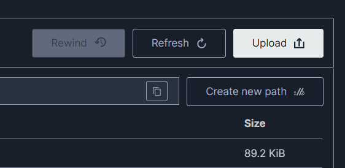

# Guía de Pruebas y Despliegue Local - MS Integración SmartSupervisión

Este documento detalla los pasos necesarios para configurar, ejecutar y probar el microservicio de integración con **SmartSupervisión (SFC)** en un entorno local.

---

## 1. Requisitos Previos

* **Python:** versión 3.10 o superior.

---

## 2. Configuración del Entorno Local

### 2.1. Clonar y Configurar Entorno Virtual

En la raíz del proyecto, ejecuta los siguientes comandos en tu terminal para crear y activar el entorno virtual e instalar las dependencias:

**En Windows (PowerShell):**

```powershell
# Crear el entorno virtual si no existe
python -m venv .venv

# Activar el entorno virtual
.venv\Scripts\Activate.ps1

# Instalar dependencias
pip install -r requirements.txt
```

**En Linux / macOS:**

```bash
# Crear el entorno virtual
python3 -m venv .venv

# Activar el entorno virtual
source .venv/bin/activate

# Instalar dependencias
pip install -r requirements.txt
```

### 2.2. Variables de Entorno (`.env`)

Crea un archivo `.env` en la raíz del proyecto (basado en las variables que utiliza el sistema) con el siguiente contenido:

```env
# Configuración general
ENVIRONMENT="development"

# Credenciales para la API SFC de SmartSupervisión (Ambiente QA o Prod)
SFC_API_BASE_URL="https://qasmart.superfinanciera.gov.co/"
SFC_USERNAME="tu_usuario_sfc"
SFC_PASSWORD="tu_password_sfc"
SFC_SECRET_KEY="tu_secret_key_sfc_suministrada"
```

---

## 3. Ejecución del Servidor Local

### 3.1. Ejecución Directa (Python)

Una vez configuradas las variables de entorno, puedes levantar el servidor de desarrollo usando `uvicorn`:

```bash
uvicorn app.main:app --reload --port 8000
```

El servidor estará disponible en [http://localhost:8000](http://localhost:8000). Puedes acceder a la documentación interactiva de la API (Swagger UI) en:

* [http://localhost:8000/docs](http://localhost:8000/docs)

### 3.2. Ejecución con Docker (Microservicio + Servidor Mock SFC)

Para probar la integración completa con un servidor mock local de la SFC sin depender de credenciales o de conectividad a la Superfinanciera real, puedes levantar el entorno en Docker usando Docker Compose:

```bash
# Levantar el microservicio y el mock de la SFC
docker compose -f infrastructure/docker-compose.yml up --build
```

Esto iniciará dos servicios comunicados en la misma red de Docker:

1. **`smartsupervision-app` (Microservicio Real):** Expone el puerto `8000` (`http://localhost:8000`). Su documentación interactiva estará en `http://localhost:8000/docs`.
2. **`mock-sfc` (Servidor Mock SFC):** Expone el puerto `8080` (`http://localhost:8080`).

**Configuración de Red en Docker:**

* El contenedor del microservicio está preconfigurado en el archivo `docker-compose.yml` para apuntar automáticamente al servidor mock mediante la variable de entorno `SFC_URL_BASE=http://mock-sfc:8080/`.
* Esto permite realizar pruebas de integración de punta a punta de los flujos del Momento 1 (`/api/v1/quejas/sync/momento-1`) y Momento 2 (`/api/v1/quejas/sync/momento-2`) de forma local e independiente de la API real de la Superfinanciera.

**Pruebas con Postman (Colección Mock):**

* En la carpeta [collections/](MS-integracion-smartsupervision/collections) encontrarás la colección `smartsupervision_mock_testing.json`.
* Puedes importar este archivo JSON en Postman para simular peticiones rápidamente y testear los flujos con el servidor mock local de forma síncrona.

---

### 3.3. Ejecución con Docker (Microservicio + MinIO para simulación de S3)

Primero, ve a la carpeta infrastructure y crea el archivo .env.test, puedes copiar y pegar el .env.example y cambiar los valores de la sfc por los que nos dieron. Si necesitas los valores relacionados a google para la conexion a la sheet me avisas (no es necesario en este momento de testeo, hay un fallback local con los mismos errores)

Para probar la integración completa con de la SFC sin depender de s3, pero con un servicio que utiliza la misma API puedes levantar el entorno en Docker usando Docker Compose:

```bash
# Levantar el microservicio con MinIO
sion> docker compose -f infrastructure/docker-compose.test.yml up --build
```

Esto iniciará dos servicios comunicados en la misma red de Docker:

1. **`smartsupervision-app` (Microservicio Real):** Expone el puerto `8000` (`http://localhost:8000`). Su documentación interactiva estará en `http://localhost:8000/docs`.
2. **`MinIO` (Emulador de AWS S3)**:
   - API de S3 (boto3/ HTTP): Expone el puerto 9000 (http://localhost:9000).
   - Consola Web de Administración: Expone el puerto 9001 (http://localhost:9001).

**Inicialización de MinIO (Creación de bucket local)**
Antes de ejecutar peticiones que involucren descarga o subida de archivos adjuntos (Momento 1, Momento 2 o Momento 3), debes crear el bucket en la consola de MinIO la primera vez que levantes el contenedor:

1. Acceder a la Consola Web: Abre tu navegador e ingresa a http://localhost:9001.
2. Iniciar Sesión: 
    Ingresa con las credenciales por defecto configuradas en el entorno:
   - Username: minioadmin
   - Password: minioadmin
3. Crear el Bucket de Trabajo:
   - En el menú lateral izquierdo, selecciona Create Bucket.
   - En el campo Bucket Name, ingresa el nombre exacto definido en la variable de entorno AWS_S3_BUCKET (por ejemplo: global66-sfc-bucket-local).
   - Haz clic en Create Bucket para finalizar.

La información del bucket persistirá en el volumen de Docker (minio_data), por lo que solo es necesario realizar este paso de creación la primera vez.

Para subir archivos es similar a utilizar drive, abres la carpeta/o la creas con Create a new path:


Finalmente solo arrastras el archivo a donde lo vas a poner o le das a upload y seleccionas el archivo

---

## 4. Ejecución de Pruebas (Test Suite)

La suite de pruebas incluye tests unitarios e integrales para verificar el comportamiento de la autenticación, generación de firmas y el flujo de sincronización de los Momentos 1 y 2.

Para ejecutar todas las pruebas, corre el siguiente comando en la raíz del proyecto con el entorno virtual activo:

```bash
python -m unittest discover -s tests
```

---

## 5. Estado de Implementación y Endpoints Registrados

### 5.1. Qué se lleva implementado

* **Autenticación y Firma Digital (HMAC-SHA256):** Generación automática de firmas para peticiones `GET`, `POST`, `PUT`, `PATCH` y Multipart (adjuntos), e inyección de cabeceras de autorización y firmas mediante interceptor HTTPX.
* **Momento 1 (Sincronización SFC -> CRM):** Obtención paginada de quejas, descarga asíncrona de archivos adjuntos y confirmación por lotes mediante el reporte ACK.
* **Momento 2 (Envío CRM -> SFC):** Envío de quejas creadas localmente y subida de archivos adjuntos de forma stateless y asíncrona.

### 5.2. Endpoints Registrados

Las siguientes rutas están registradas y listas para ser consumidas bajo el prefijo `/api/v1`:

| Método        | Endpoint                          | Descripción                                                                                                                              |
| :------------- | :-------------------------------- | :---------------------------------------------------------------------------------------------------------------------------------------- |
| **GET**  | `/health`                       | Chequeo de salud del servicio (Usado por AWS ALB).                                                                                        |
| **POST** | `/api/v1/quejas/sync/momento-1` | **Ejecuta la Sincronización Completa del Momento 1:** descarga quejas nuevas de la SFC, sube adjuntos a S3, y reporta el lote ACK. |
| **POST** | `/api/v1/quejas/sync/momento-2` | **Ejecuta el Envío del Momento 2:** recibe los datos del CRM, los transforma/valida, los envía a la SFC y sube sus anexos.        |

---

## 6. Consideraciones y Notas de Desarrollo

1. **AWS S3:** En desarrollo local, la subida a S3 está mockeada. Se requiere configurar las credenciales de AWS en producción/qa para que el pipeline guarde los adjuntos permanentemente en el bucket correspondiente.
