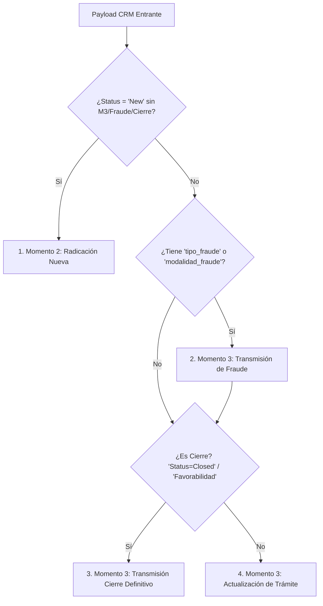

# 📘 Diccionario de Datos y Especificaciones de Campos (SFC ↔ CRM)

Este documento constituye la **fuente única de verdad** para los esquemas de datos, contratos de payload, campos obligatorios y reglas de negocio aplicadas en la integración entre **Salesforce CRM** y la **Superintendencia Financiera de Colombia (SFC)** a través del microservicio de despacho.

---

## 📌 1. Campos Base Obligatorios (Comunes a Todos los Escenarios)

Toda petición enviada al endpoint de despacho (`/api/v1/quejas/sync/despacho`) debe incluir obligatoriamente los siguientes **11 campos base**:

1. **`Case_id`** o **`Smart_Code__c`** *(Al menos uno de los dos debe estar presente para la identificación del caso)*.
2. **`SuppliedName`** *(Nombre completo del reclamante)*.
3. **`SC_id_type__c`** *(Tipo de documento: CC, CE, PAS, RUT, NIT, etc.)*.
4. **`id_number__c`** *(Número de documento, solo dígitos, máximo 15 caracteres)*.
5. **`tipo_de_persona__c`** *(Tipo de cliente: B2C, B2B)*.
6. **`direccion__c`** *(Dirección física de correspondencia)*.
7. **`punto_recepcion`** *(Canal o punto de recepción)*.
8. **`Description`** *(Texto libre con el detalle de la reclamación, máximo 4500 caracteres)*.
9. **`smart_escalamiento_DCF__c`** *(Indica si escala al Defensor del Consumidor Financiero)*.
10. **`Product__c`** *(Línea de producto o servicio reclamado)*.
11. **`Categorias_COL__c`** *(Categoría o motivo principal normativo)*.

---

## 📊 2. Tabla Maestra de Campos del Payload Unificado

A continuación se detallan todos los atributos soportados por el esquema DTO `QuejaUnificadaCrmInput`:

| Campo CRM | ¿Opcional? | Valor por Defecto | Tipo de Dato | Descripción / Regla de Negocio |
| :--- | :---: | :---: | :---: | :--- |
| **`Case_id`** | Sí | `null` | String | Identificador primario en Salesforce. Obligatorio si no viene `Smart_Code__c`. |
| **`Smart_Code__c`** | Sí | `null` | String | Código unificado asignado SFC/CRM. Obligatorio si no viene `Case_id`. |
| **`CreatedDate`** | No | N/A | ISO Datetime | Fecha/hora de creación del caso en el CRM. |
| **`Status`** | Sí | `"New"` | String | Estado del caso en CRM (`New`, `In Progress`, `Closed`). Infiere la fase de despacho. |
| **`SuppliedName`** | No | N/A | String | Nombre del consumidor financiero. Sanitizado automáticamente contra XSS. |
| **`SC_id_type__c`** | No | N/A | String | Tipo de identificación (CC, CE, NIT, PAS, etc.). Mapeado al catálogo SFC. |
| **`id_number__c`** | No | N/A | String | Número de identificación. Validación estricta: dígitos numéricos, máx. 15 caracteres. |
| **`sc_genero__c`** | Sí | `null` | String | Género del cliente (Masculino, Femenino, No informa). |
| **`tipo_de_persona__c`** | No | N/A | String | Naturaleza del cliente (`B2C` para Natural, `B2B` para Jurídica). |
| **`sc_LGBTIQ__c`** | Sí | `null` | String | Pertenencia a la comunidad LGBTIQ+ (`Si`, `No`). |
| **`sc_Condicion_especial__c`** | Sí | `null` | String | Vulnerabilidad o condición especial (Desplazado, Adulto mayor, etc.). |
| **`SuppliedPhone`** | Sí | `null` | String | Teléfono o celular del cliente. |
| **`SuppliedEmail`** | Sí | `null` | String | Correo electrónico de notificación. |
| **`direccion__c`** | No | N/A | String | Dirección física del reclamante. |
| **`Departamento__c`** | Sí | `null` | String | Departamento de residencia (mapeado vía catálogo DIVIPOLA). |
| **`SC_municipio__c`** | Sí | `null` | String | Municipio de residencia (mapeado vía catálogo DIVIPOLA). |
| **`canal__c`** | Sí | `null` | String | Canal de recepción de la reclamación (Web, App, Presencial, etc.). |
| **`punto_recepcion`** | No | N/A | String | Punto de recepción (Web, Manual, etc.). |
| **`Instancia_de_recepcion__c`** | Sí | `"Entidad vigilada"` | String | Instancia receptora normativa. |
| **`admision_col__c`** | Sí | `"No Aplica"` | String | Estado de admisión de la queja. |
| **`Description`** | No | N/A | String | Detalle o narrativa de la queja. Máximo 4500 caracteres, sanitizado de HTML. |
| **`smart_anexo_queja__c`** | Sí | `false` | Boolean | Indica si la queja cuenta con documentos adjuntos. |
| **`Tutela__c`** | Sí | `"No"` | String | Indica si el caso proviene de una acción de tutela. |
| **`Ente_de_control__c`** | Sí | `null` | String | Ente de control que remite la queja (Superfinanciera, Fiscalía, etc.). |
| **`smart_escalamiento_DCF__c`** | No | N/A | String | Indica si la queja fue trasladada al Defensor del Consumidor Financiero (`Si`, `No`). |
| **`marcacion__c`** | Sí | `null` | String | Marcación o etiqueta operativa interna. |
| **`Product__c`** | No | N/A | String | Producto financiero afectado (Cuenta, Tarjeta, Exchange, etc.). |
| **`smart_Producto_nombre__c`** | Sí | `null` | String | Nombre comercial del producto digital. |
| **`Categorias_COL__c`** | No | N/A | String | Macro motivo / Categoría de la queja. Mapeado al catálogo normativo SFC. |
| **`archivos_s3`** | Sí | `[]` | List[Object] | Lista de objetos con metadatos de archivos subidos en S3 (`nombre_archivo`, `s3_key`, `bucket`). |
| **`directorio_s3`** | Sí | `null` | String | Ruta de directorio S3. Permite inspección y enlistado automático de adjuntos. |
| **`producto_digital__c`** | Sí | `"Si"` | String | Indica si la queja está asociada a un producto digital. |
| **`tipo_fraude__c`** | Sí | `null` | String | Tipo de fraude investigado. **Gatillo para activar Pipeline de Fraude en M3**. |
| **`modalidad_fraude__c`** | Sí | `null` | String | Modalidad específica del fraude (Suplantación, Phishing, Cajero, etc.). |
| **`card_amount__c`** | Sí | `0.0` | Float | Monto financiero total reclamado en eventos de fraude. |
| **`Total_Devuelto_por_Desconocimiento__c`** | Sí | `0.0` | Float | Monto devuelto o reconocido al cliente por la entidad. |
| **`nombre_archivo_fraude`** | Sí | `null` | String | Nombre del archivo de informe de fraude. Requerido si `len(archivos_s3) > 1`. |
| **`ClosedDate`** | Sí | `null` | ISO Datetime | Fecha/hora de cierre. **Gatillo de Cierre Definitivo en M3**. Default: Fecha/Hora actual. |
| **`Favorabilidad__c`** | Sí | `null` | String | Dictamen final (`Favorable`, `Parcialmente Favorable`, `No Favorable`). |
| **`a_favor_de__c`** | Sí | `null` | String | Entidad o persona a cuyo favor se resuelve el caso. |
| **`Aceptacion__c`** | Sí | `null` | String | Aceptación formal de las decisiones por parte de la entidad vigilada. |
| **`Rectificacion__c`** | Sí | `null` | String | Indica si hubo rectificación antes de la decisión del DCF. |
| **`Prorroga__c`** | Sí | `null` | Integer | Número de días de prórroga solicitados/concedidos. |
| **`cuerpo_respuesta_final`** | Sí | `null` | String | HTML/Texto para la generación del PDF dictamen de cierre. Si es nulo, usa plantilla base. |
| **`Quejas_express__c`** | Sí | `No` | String | Indicador si es una queja exprés |

---

## ⚙️ 3. Especificación por Escenario de Negocio

El orquestador de despacho infiere automáticamente la fase y operaciones necesarias evaluando la estructura del payload entrante:

### 1️⃣ Momento 2 Base (Radicación Inicial / Queja Nueva)
* **Requisitos:** 11 campos base comunes + `Status = "New"`.
* **Comportamiento:** Se registra la queja inicial en la base de datos de la SFC.
* **Valores Predeterminados:**
  * `Status`: `"New"`
  * `Tutela__c`: `"No"`
  * `admision_col__c`: `"No Aplica"`
  * `Instancia_de_recepcion__c`: `"Entidad vigilada"`
  * `smart_anexo_queja__c`: `false`
  * `archivos_s3`: `[]`

### 2️⃣ Momento 3 Actualización Normal (Trámite)
* **Requisitos:** 11 campos base comunes + `Status = "In Progress"` o `"Stand by"`.
* **Condición:** No deben enviarse campos específicos de Cierre ni de Fraude.
* **Comportamiento:** Actualiza metadatos del caso e informa avance del trámite ante la SFC (`estado_cod = 2`).

### 3️⃣ Momento 3 Gestión de Fraude
* **Gatillo de Activación:** Presencia de `tipo_fraude__c` o `modalidad_fraude__c`.
* **Campos Condicionales Obligatorios:**
  * **`archivos_s3`**: Debe contener **al menos 1 archivo** (documentación de soporte de la investigación de fraude).
  * **`nombre_archivo_fraude`**: Obligatorio únicamente si se envían **2 o más archivos** en `archivos_s3` (si viene un único archivo, el sistema lo infiere automáticamente).
* **Manejo de Montos:** `card_amount__c` y `Total_Devuelto_por_Desconocimiento__c` se envían con sus valores reales o `0.0` por defecto.
* **Procesamiento de Adjuntos:** Los archivos asociados son subidos a S3/SFC inyectando el afijo normativo `INV_FRAUDE_SFC`.

### 4️⃣ Momento 3 Cierre Definitivo
* **Gatillo de Activación:** `Status = "Closed"`, presencia de `ClosedDate` o asignación de `Favorabilidad__c`.
* **Campos Obligatorios de Cierre:**
  1. **`Favorabilidad__c`** (`Favorable`, `Parcialmente Favorable`, `No Favorable`).
  2. **`Aceptacion__c`** (Texto descriptivo de aceptación).
* **Generación de PDF Dictamen:**
  * Si viene `cuerpo_respuesta_final`, el sistema renderiza dinámicamente un PDF estilizado mediante ReportLab, lo almacena en S3 bajo la ruta `caso/cierre/` y transmite el adjunto a la SFC con el afijo normativo `RESP_FINAL_SFC`.
  * Si `cuerpo_respuesta_final` no está presente, se autogenera un documento base formal.
* **Fecha de Cierre:** Si `ClosedDate` es nulo, se asigna la fecha/hora actual en zona horaria de Bogotá (`America/Bogota`).

---

## 🩹 4. Resiliencia y Mecanismos Especiales

### 🔄 Mecanismo de Auto-Recuperación (Self-Healing)
Si el orquestador intenta aplicar un paso de Momento 3 (Trámite, Fraude o Cierre) sobre un caso que no existe previamente en la base de datos de la SFC (la SFC retorna `HTTP 404 Not Found` o un `400` equivalente), se activa la secuencia automática:

1. **Paso A (Radicación Base M2):** El orquestador crea la queja inicial en Momento 2 usando los 11 campos base (omitiendo adjuntos iniciales).
2. **Paso B (Re-ejecución M3):** Una vez recibido el código SFC, se re-ejecuta de forma transparente el pipeline de Momento 3 para aplicar los adjuntos, reportes de fraude o el cierre definitivo.

### 🛡️ Manejo de Reintentos y Casos Previamente Cerrados
Si un reintento encolado contiene intenciones compuestas (ej. Fraude + Cierre) y la SFC responde que la queja ya cuenta con respuesta final o está en Estado 4 (Cerrado):
* El orquestador captura la excepción en la etapa intermedia de fraude, omite la falla de actualización con un aviso `WARNING` y prosigue directamente al cierre o confirma el éxito de la entrega.