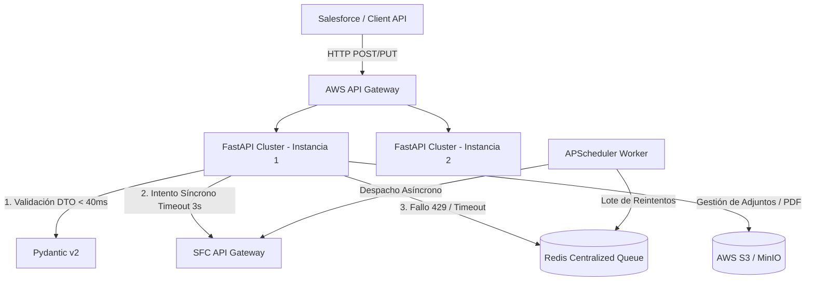
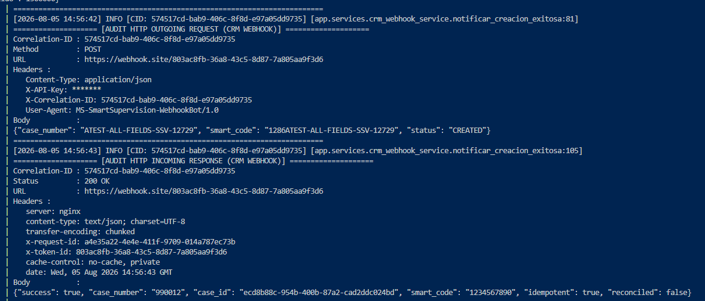
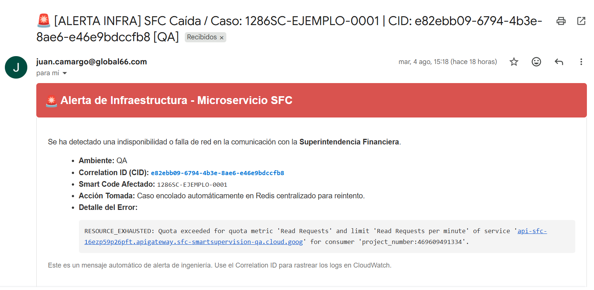
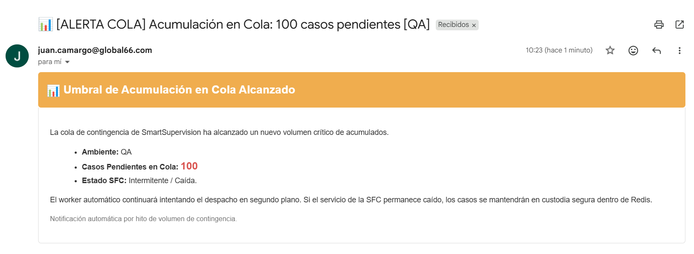
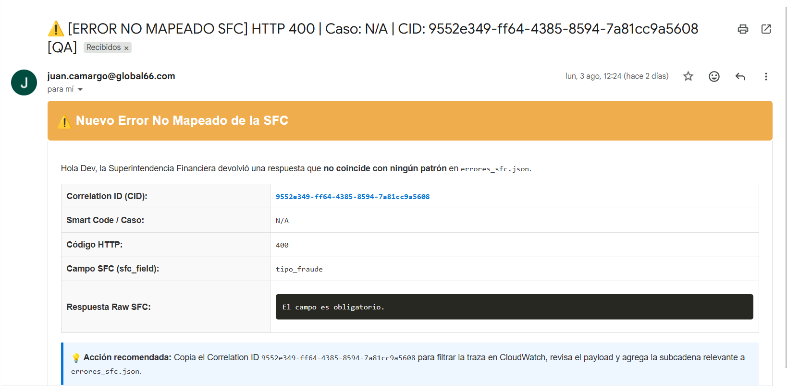
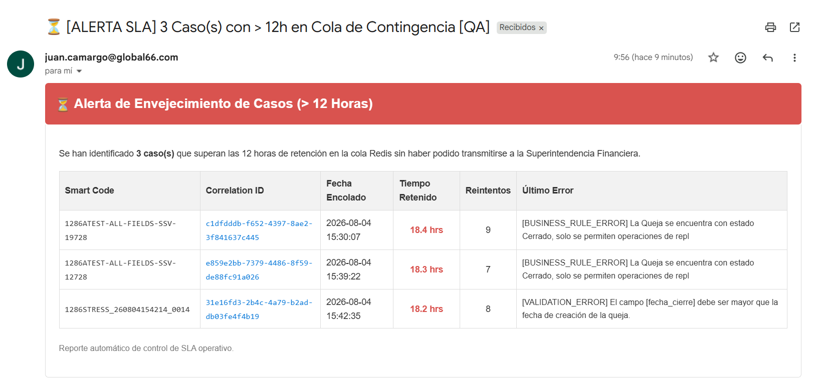
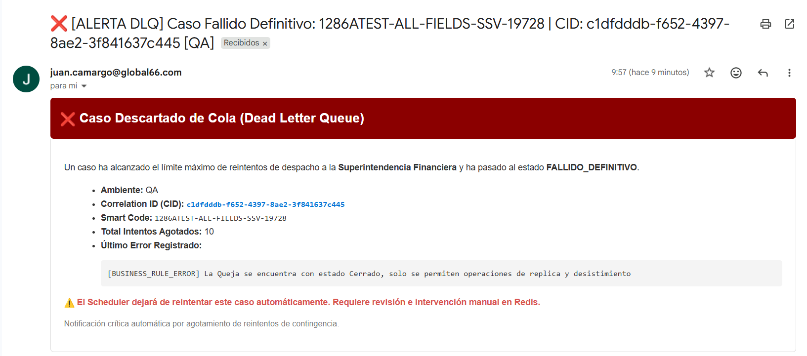
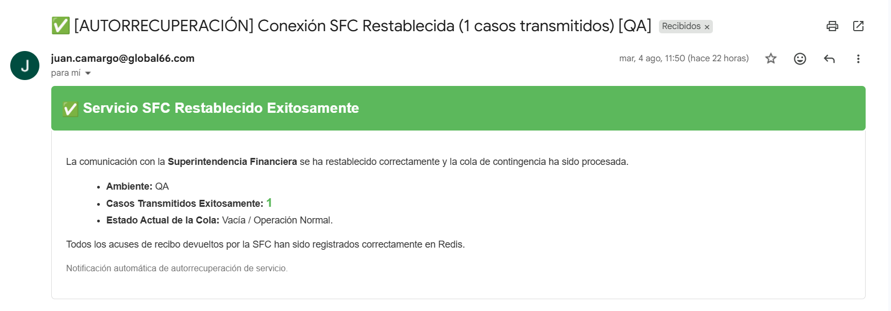

"""

# 🚀 Microservicio de Integración SFC (SmartSupervisión) - Global66

Microservicio *Stateless* de alto rendimiento diseñado para la sincronización y orquestación bidireccional de reclamaciones (PQRS) entre **Salesforce CRM** y la **Superintendencia Financiera de Colombia (SFC)**, garantizando tolerancia a fallos, resiliencia ante saturación de red y sanitización de seguridad.

---

## 🏗️ Arquitectura del Sistema

El microservicio está diseñado bajo una arquitectura distribuida y desacoplada, con capacidad de escalado horizontal en **AWS ECS + Fargate**



---

## ✨ Características Principales

* **🛡️ Sanitización Preventiva contra Stored XSS:** Filtro automático en la capa de entrada (Pydantic DTO) que remueve bloques `<script>`, `<iframe>` y etiquetas HTML peligrosas en campos de texto libre (`SuppliedName`, `direccion__c`, `Description`), preservando caracteres Unicode y Emojis.
* **⚡ Validación de Capa de Entrada Ultra-Rápida:** Rechazo de payloads inválidos (documentos mayores a 15 caracteres, categorías fuera de catálogo, cierres sin favorabilidad, nombres vacíos) en menos de 40 ms, evitando saturar la API externa.
* **🔄 Mecanismo de Contingencia y Resiliencia (Redis + APScheduler):** Si la API de la SFC está lenta (>3s) o devuelve cuota agotada (`HTTP 429 / RESOURCE_EXHAUSTED`), el caso se encola de inmediato en Redis y responde `HTTP 202 Accepted` al cliente, procesándose en segundo plano.
* **🩹 Mecanismo de Auto-Recuperación (Self-Healing):** Si la SFC devuelve un error `404 Not Found` al intentar actualizar un caso en Momento 3, el orquestador radicará automáticamente la queja base en Momento 2 y re-ejecutará la actualización de M3 de forma transparente.
* **📄 Generación Automática de Dictámenes PDF:** Renderizado dinámico de respuestas finales de cierre en formato PDF mediante ReportLab, subida automática a S3 y transmisión del adjunto a la SFC con el afijo normativo `RESP_FINAL_SFC`.

---

## 🛠️ Requisitos del Sistema

* **Python:** 3.12+
* **Docker & Docker Compose:** v2.20+
* **Redis:** 7.0+ (Servidor centralizado de colas)
* **Storage S3:** AWS S3 o MinIO (Emulador local)

---

## ⚙️ Variables de Entorno (`.env`)

Crea un archivo `.env` en la raíz del proyecto tomando como base `.env.example`:

| Variable                    | Descripción                                        | Valor por Defecto                 |
| :-------------------------- | :-------------------------------------------------- | :-------------------------------- |
| `ENVIRONMENT`             | Entorno de ejecución (`local`, `qa`, `prod`) | `qa`                            |
| `PROJECT_NAME`            | Nombre del Microservicio                            | `ms-test-integracion`           |
| `SFC_URL_BASE`            | URL Base del API Gateway de la SFC                  | `https://api-sfc-qa.cloud.goog` |
| `SFC_TIPO_ENTIDAD`        | Tipo de entidad asignado por la SFC                 | `14`                            |
| `SFC_ENTIDAD_COD`         | Código único de la entidad                        | `23`                            |
| `REDIS_HOST`              | Host del servidor Redis                             | `redis`                         |
| `REDIS_PORT`              | Puerto de Redis                                     | `6379`                          |
| `AWS_S3_ENDPOINT_URL`     | URL de S3 o MinIO                                   | `http://minio:9000`             |
| `SFC_MINI_RETRY_ATTEMPTS` | Reintentos HTTP síncronos inmediatos               | `0` (Sencillo a cola)           |

---

## 🚀 Despliegue Local con Docker

### 1. Levantar la infraestructura completa con Balanceador y Réplicas

Para simular el entorno de producción (ECS + Fargate + ALB):

```bash
    python tests/generators/test_secuencial_despacho.py
```

### 2. Verificar la salud de la aplicación

Abre tu navegador o realiza un `curl`:

* **Healthcheck:** `http://localhost:8000/health`
* **Swagger UI:** `http://localhost:8000/docs`

---

## 🧪 Pruebas y Suites de Stress

El proyecto incluye scripts generadores para validar la tolerancia a fallos, reglas de negocio y cargas concurrentes:

### Pruebas Secuenciales E2E (40 escenarios)

Ejecuta la batería de pruebas funcionales que cubre casos borde, Unicode, HTMLs pesados y errores controlados:

```bash
    python tests/generators/test_secuencial_despacho.py
```

### Pruebas de Carga y Estrés Masivo (Concurrencia)

Simula ráfagas de peticiones concurrentes enviadas directamente al balanceador Nginx:

```bash
    python tests/generators/test_stress_local.py
```

---

## 📂 Estructura del Proyecto

ms-test-integracion/
├── app/
│   ├── api/                   # Endpoints HTTP (Routes, Health, Dependencies)
│   ├── core/                  # Mappers, Exceptions, Security (XSS), Config
│   ├── db/                    # Clientes de Redis
│   ├── integrations/          # SfcClient (HTTPX, TLS 1.2, Interceptores)
│   ├── models/                # Modelos ORM y estructuras de cola
│   ├── schemas/               # DTOs Pydantic v2 (Validation & Sanitization)
│   ├── services/              # Orquestador, Momento 2/3 Sync, S3 Service
│   ├── utils/                 # Generador PDF y Parser HTML
│   └── workers/               # APScheduler (Scheduler de reintentos)
├── docs/                      # Planes de desarrollo y especificaciones
├── infrastructure/            # Dockerfile, Docker Compose, Nginx Config
├── tests/                     # Tests unitarios, de integración y generadores
├── Como_testear.md            # Guía detallada para testers QA
├── requirements.txt           # Dependencias de Python
└── README.md                  # Portada técnica del proyecto

---

## 🔔 Notificaciones, Webhooks y Sistema de Alertas (SFC ↔ CRM)

Este documento detalla los mecanismos de comunicación asíncrona, confirmación de entregas hacia **Salesforce CRM** y el sistema de **Alertas Automáticas de Ingeniería (SMTP)** ante eventos operativos o caídas de infraestructura.

---

### 📡 1. Webhook de Confirmación al CRM (Salesforce)

Cuando un caso es encolado en Redis debido a una indisponibilidad temporal de la SFC, el microservicio asume la responsabilidad de completar la entrega. Tan pronto como el *Scheduler Worker* logra despachar el caso exitosamente a la SFC con respuesta **HTTP 200 OK**, dispara de inmediato una notificación **POST** hacia Salesforce.

#### ⚙️ Especificación del Contrato HTTP

* **Método:** `POST`
* **URL:** Configurada en variable de entorno `CRM_WEBHOOK_URL` (Ej: `https://crm.global66.com/api/integrations/smartsupervision/complaint-code`)
* **Headers Obligatorios:**
  * `Content-Type`: `application/json`
  * `X-API-Key`: Clave de autenticación (`CRM_WEBHOOK_API_KEY`)
  * `X-Correlation-ID`: Identificador único de traza (UUIDv4)
  * `User-Agent`: `MS-SmartSupervision-WebhookBot/1.0`

#### 📦 Payload Enviado al CRM

```json
    {
        "case_number": "CASO_SF_2026_0012",
        "smart_code": "1286CASO_SF_2026_0012",
        "status": "CREATED"
    }
```

#### 🖼️ Ejemplo de Auditoría HTTP en Logs / Consola



---

### 📧 2. Sistema de Alertas por Correo Electrónico (EmailAlertService)

El microservicio cuenta con un módulo de monitoreo proactivo que envía alertas en formato HTML estilizado mediante transporte **SMTP con TLS** (`EmailAlertService`).

#### 📋 Matriz de Eventos y Despacho de Alertas

| Evento de Alerta | Disparador / Gatillo | Frecuencia |
| :--- | :--- | :--- |
| **1. Caída de Infraestructura** | Primer caso que entra a la cola cuando estaba vacía (0 pendientes). | Inmediata |
| **2. Umbral de Acumulación** | La cola de Redis alcanza múltiplos de **100 casos pendientes**. | Por cada 100 casos |
| **3. Error No Mapeado SFC** | La SFC responde con un error no registrado en `errores_sfc.json`. | Inmediata |
| **4. Digest SLA (>12h)** | Existen casos retenidos en cola por más de **12 horas**. | En cada ciclo del Scheduler |
| **5. Dead Letter Queue (DLQ)** | Un caso alcanza el límite de **20 reintentos** (`FALLIDO_DEFINITIVO`). | Inmediata |
| **6. Autorrecuperación SFC** | La SFC vuelve a estar online y la cola se vacía por completo (0 pendientes). | Eventual |

---

#### 📸 Especificación y Capturas por Tipo de Alerta

##### 🚨 Alerta 1: Caída de Infraestructura / Indisponibilidad SFC

Notifica inmediatamente al equipo cuando se detecta un corte de red, error 502/503 o cuota superada (429) y el primer caso es resguardado en Redis.



---

##### 📊 Alerta 2: Umbral de Acumulación en Cola (Múltiplos de 100)

Mantiene informado al negocio sobre el volumen de casos represados durante contingencias prolongadas.



---

##### ⚠️ Alerta 3: Error No Mapeado en la SFC (Exclusivo Dev)

Envía directamente al desarrollador la respuesta raw JSON enviada por la SFC cuando no coincide con ninguna regla de la matriz, facilitando la actualización de `errores_sfc.json` o Google Sheets.



---

##### ⏳ Alerta 4: Digest de Control de SLA (> 12 Horas Retenidos)

Genera una tabla resumen con los casos que llevan más de 12 horas esperando ser entregados a la SFC, mostrando tiempo acumulado, reintentos y último error.



---

##### ❌ Alerta 5: Caso Fallido Definitivo / Dead Letter Queue (DLQ)

Se dispara cuando un caso agota sus **20 reintentos automáticos** (~31.67 horas en cola). Informa que el caso requiere auditoría manual.



---

##### ✅ Alerta 6: Restablecimiento y Autorrecuperación de Servicio

Confirma al equipo que la comunicación con la SFC se restableció y que el *Scheduler* logró vaciar la cola satisfactoriamente.



---

## 🧮 3. Ciclo de Vida, Retención y Backoff en Redis

La cola utiliza un algoritmo de **Backoff Lineal** para espaciar los reintentos y evitar saturar la SFC.

* **Intervalo Base (`QUEUE_RETRY_INTERVAL_MINUTES`):** 10 minutos.
* **Máximo de Reintentos (`QUEUE_MAX_RETRIES`):** 20 intentos.
* **Tiempo Máximo en Cola:** **1,900 minutos (31 horas y 40 minutos / 1.32 días)**.

### Tabla de Progresión de Reintentos

| N° Reintento | Tiempo de Espera |   Tiempo Acumulado   |         Horas Acumuladas         |
| :-----------: | :--------------: | :------------------: | :------------------------------: |
|       1       |      10 min      |        10 min        |              0.17 h              |
|       2       |      20 min      |        30 min        |              0.50 h              |
|       5       |      50 min      |       150 min       |              2.50 h              |
|      10      |     100 min     |       550 min       |              9.17 h              |
|      15      |     150 min     |      1,200 min      |             20.00 h             |
|      19      |     190 min     | **1,900 min** |        **31.67 h**        |
|      20      |      0 min      | **Pasa a DLQ** | **`FALLIDO_DEFINITIVO`** |

> 🛡️ **Nota sobre caídas prolongadas:** Si la SFC responde con un error de infraestructura (`429 Throttled`, `502 Bad Gateway`), el *Circuit Breaker* pospone la ejecución de la tanda **sin incrementar el contador de intentos**, protegiendo el caso de ser descartado prematuramente.
