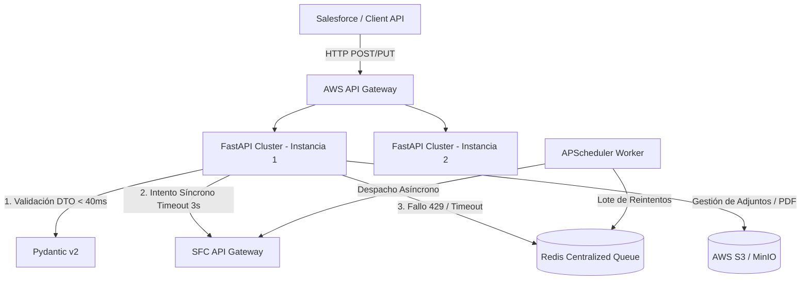

"""

# 🚀 Microservicio de Integración SFC (SmartSupervisión) - Global66

Microservicio *Stateless* de alto rendimiento diseñado para la sincronización y orquestación bidireccional de reclamaciones (PQRS) entre **Salesforce CRM** y la **Superintendencia Financiera de Colombia (SFC)**, garantizando tolerancia a fallos, resiliencia ante saturación de red y sanitización de seguridad.

---

## 🏗️ Arquitectura del Sistema

El microservicio está diseñado bajo una arquitectura distribuida y desacoplada, con capacidad de escalado horizontal en **AWS ECS + Fargate**



---

## ✨ Características Principales

* **🛡️ Sanitización Preventiva contra Stored XSS:** Filtro automático en la capa de entrada (Pydantic DTO) que remueve bloques `<script>`, `<iframe>` y etiquetas HTML peligrosas en campos de texto libre (`SuppliedName`, `direccion__c`, `Description`), preservando caracteres Unicode y Emojis.
* **⚡ Validación de Capa de Entrada Ultra-Rápida:** Rechazo de payloads inválidos (documentos mayores a 15 caracteres, categorías fuera de catálogo, cierres sin favorabilidad, nombres vacíos) en menos de 40 ms, evitando saturar la API externa.
* **🔄 Mecanismo de Contingencia y Resiliencia (Redis + APScheduler):** Si la API de la SFC está lenta (>3s) o devuelve cuota agotada (`HTTP 429 / RESOURCE_EXHAUSTED`), el caso se encola de inmediato en Redis y responde `HTTP 202 Accepted` al cliente, procesándose en segundo plano.
* **🩹 Mecanismo de Auto-Recuperación (Self-Healing):** Si la SFC devuelve un error `404 Not Found` al intentar actualizar un caso en Momento 3, el orquestador radicará automáticamente la queja base en Momento 2 y re-ejecutará la actualización de M3 de forma transparente.
* **📄 Generación Automática de Dictámenes PDF:** Renderizado dinámico de respuestas finales de cierre en formato PDF mediante ReportLab, subida automática a S3 y transmisión del adjunto a la SFC con el afijo normativo `RESP_FINAL_SFC`.

---

## 🛠️ Requisitos del Sistema

* **Python:** 3.12+
* **Docker & Docker Compose:** v2.20+
* **Redis:** 7.0+ (Servidor centralizado de colas)
* **Storage S3:** AWS S3 o MinIO (Emulador local)

---

## ⚙️ Variables de Entorno (`.env`)

Crea un archivo `.env` en la raíz del proyecto tomando como base `.env.example`:

| Variable                    | Descripción                                        | Valor por Defecto                 |
| :-------------------------- | :-------------------------------------------------- | :-------------------------------- |
| `ENVIRONMENT`             | Entorno de ejecución (`local`, `qa`, `prod`) | `qa`                            |
| `PROJECT_NAME`            | Nombre del Microservicio                            | `ms-test-integracion`           |
| `SFC_URL_BASE`            | URL Base del API Gateway de la SFC                  | `https://api-sfc-qa.cloud.goog` |
| `SFC_TIPO_ENTIDAD`        | Tipo de entidad asignado por la SFC                 | `14`                            |
| `SFC_ENTIDAD_COD`         | Código único de la entidad                        | `23`                            |
| `REDIS_HOST`              | Host del servidor Redis                             | `redis`                         |
| `REDIS_PORT`              | Puerto de Redis                                     | `6379`                          |
| `AWS_S3_ENDPOINT_URL`     | URL de S3 o MinIO                                   | `http://minio:9000`             |
| `SFC_MINI_RETRY_ATTEMPTS` | Reintentos HTTP síncronos inmediatos               | `0` (Sencillo a cola)           |

---

## 🚀 Despliegue Local con Docker

### 1. Levantar la infraestructura completa con Balanceador y Réplicas

Para simular el entorno de producción (ECS + Fargate + ALB):

```bash
    python tests/generators/test_secuencial_despacho.py
```

### 2. Verificar la salud de la aplicación

Abre tu navegador o realiza un `curl`:

* **Healthcheck:** `http://localhost:8000/health`
* **Swagger UI:** `http://localhost:8000/docs`

---

## 🧪 Pruebas y Suites de Stress

El proyecto incluye scripts generadores para validar la tolerancia a fallos, reglas de negocio y cargas concurrentes:

### Pruebas Secuenciales E2E (40 escenarios)

Ejecuta la batería de pruebas funcionales que cubre casos borde, Unicode, HTMLs pesados y errores controlados:

```bash
    python tests/generators/test_secuencial_despacho.py
```

### Pruebas de Carga y Estrés Masivo (Concurrencia)

Simula ráfagas de peticiones concurrentes enviadas directamente al balanceador Nginx:

```bash
    python tests/generators/test_stress_local.py
```

---

## 📂 Estructura del Proyecto

ms-test-integracion/
├── app/
│   ├── api/                   # Endpoints HTTP (Routes, Health, Dependencies)
│   ├── core/                  # Mappers, Exceptions, Security (XSS), Config
│   ├── db/                    # Clientes de Redis
│   ├── integrations/          # SfcClient (HTTPX, TLS 1.2, Interceptores)
│   ├── models/                # Modelos ORM y estructuras de cola
│   ├── schemas/               # DTOs Pydantic v2 (Validation & Sanitization)
│   ├── services/              # Orquestador, Momento 2/3 Sync, S3 Service
│   ├── utils/                 # Generador PDF y Parser HTML
│   └── workers/               # APScheduler (Scheduler de reintentos)
├── docs/                      # Planes de desarrollo y especificaciones
├── infrastructure/            # Dockerfile, Docker Compose, Nginx Config
├── tests/                     # Tests unitarios, de integración y generadores
├── Como_testear.md            # Guía detallada para testers QA
├── requirements.txt           # Dependencias de Python
└── README.md                  # Portada técnica del proyecto

---

## 📑 Licencia y Soporte

Desarrollado para la integración oficial de **Global66** con la **Superintendencia Financiera de Colombia (SFC)**. Para soporte interno o reporte de incidencias, contactar al equipo de arquitectura de software.
"""
